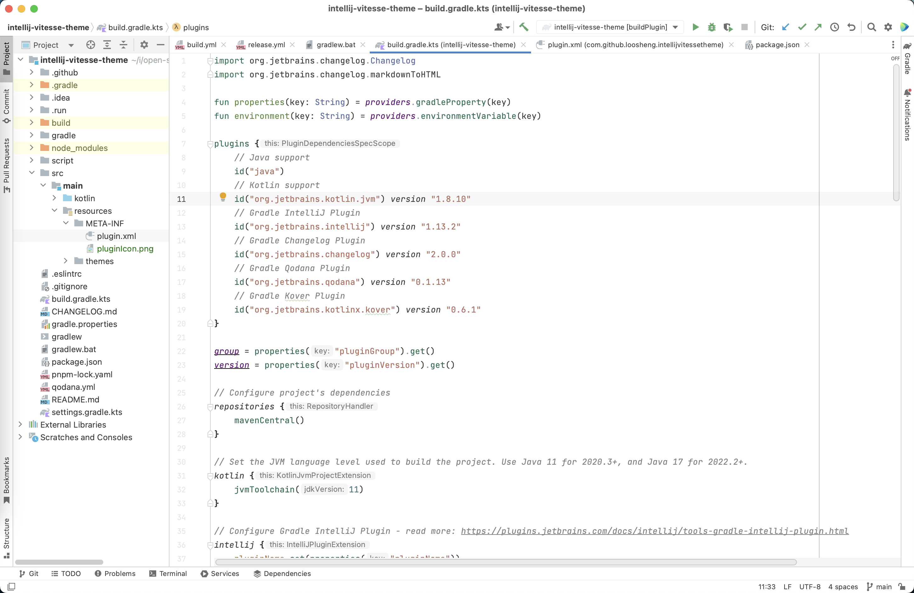
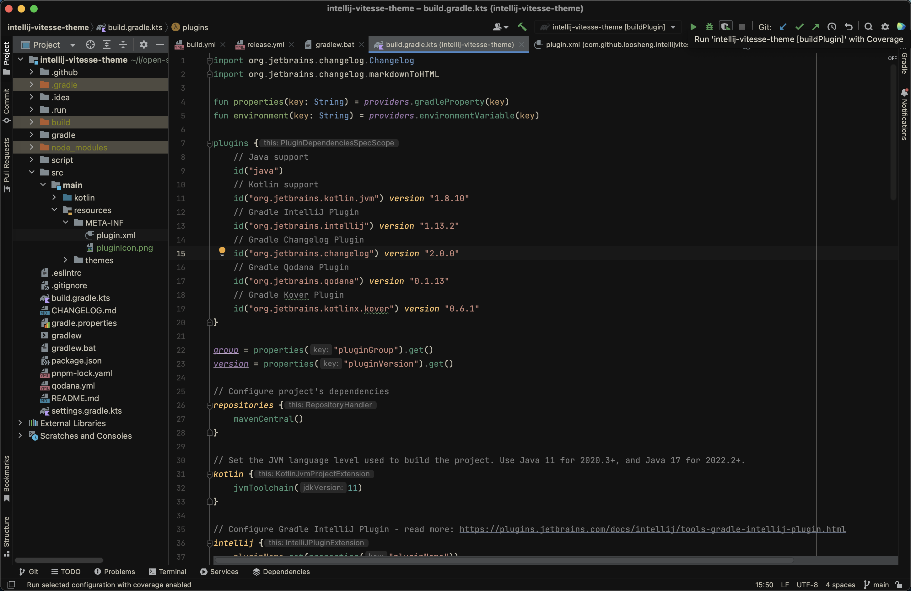
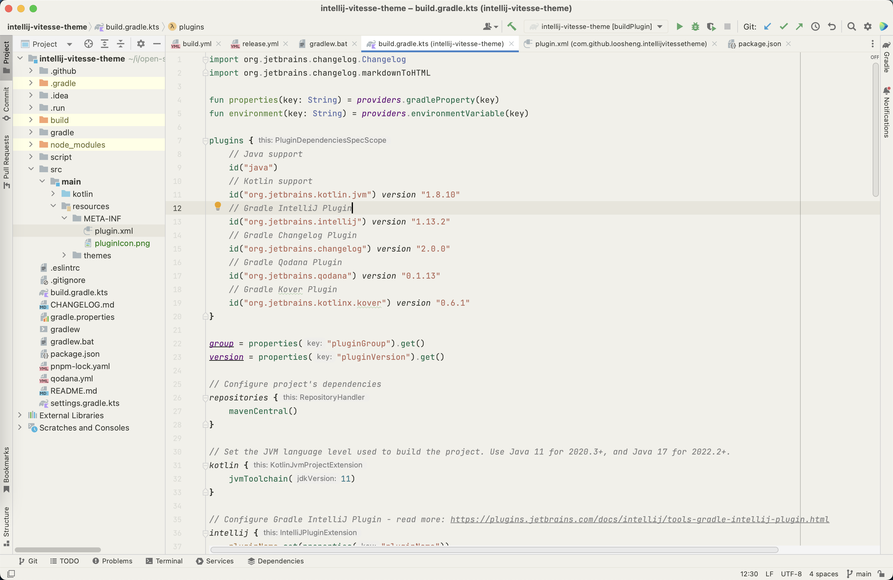
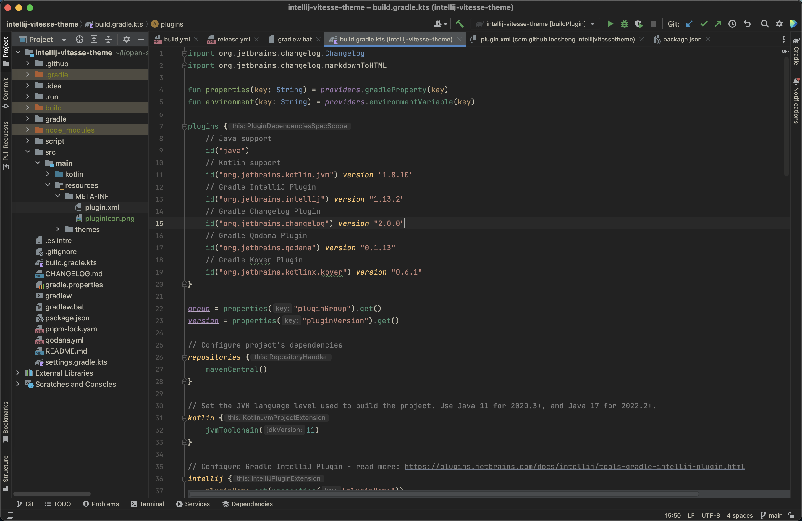
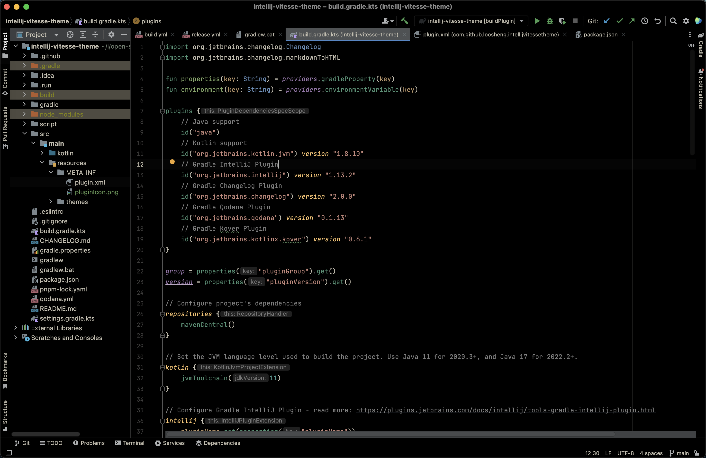

<!-- Plugin description -->
<h1 align="center">Intellij Vitesse Theme</h1>

<p align="center">

<a href="https://plugins.jetbrains.com/plugin/com.github.loosheng.intellijvitessetheme">

</a>
<a href="https://plugins.jetbrains.com/plugin/com.github.loosheng.intellijvitessetheme">

</a>
</p>

<h3 align="center">❗In the early stage of porting</h3>
<h3 align="center"> Ported from antfu's <a href="https://github.com/antfu/vscode-theme-vitesse">
vscode-theme-vitesse</a></h3>

<!-- Plugin description end -->

## Screenshots

<div align="center">
  
  
</div>
<div align="center">Vitesse Light & Vitesse Dark</div>
<br />
<div align="center">
 
 
</div>
<div align="center">Vitesse Light Soft & Vitesse Dark Soft</div>
<br />
<div align="center">
  
  <div align="center">Vitesse Black</div>  
</div>

## Installation

- Using IDE built-in plugin system:

  <kbd>Settings/Preferences</kbd> > <kbd>Plugins</kbd> > <kbd>Marketplace</kbd> > <kbd>Search for "Vitesse
  theme"</kbd> >
  <kbd>Install Plugin</kbd>

- Manually:

  Download the [latest release](https://github.com/loosheng/intellij-vitesse-theme/releases/latest) and install it
  manually using
  <kbd>Settings/Preferences</kbd> > <kbd>Plugins</kbd> > <kbd>⚙️</kbd> > <kbd>Install plugin from disk...</kbd>

---
## Development

1. Install dependencies

```bash
# Install script dependencies
pnpm install

# Install Java Dependencies or open in intellij IDEA (auto index)
# gradlew manual install dependencies
./gradlew dependencies

```

2. start dev script

```bash
  pnpm run dev
```

3. modify `script/*` content

4. index done, start intellij IDEA run 'runIde'

---

## SVG Logo Design

[Vitesse Logo Design](https://mastergo.com/goto/pDDCTgJo?file=90290510852665)

---

## Thanks

This project Ported from [vscode-theme-vitesse](https://github.com/antfu/vscode-theme-vitesse).

---
## License
MIT - Copyright (c) 2021 Anthony Fu <br>
MIT - Copyright (c) 2023 LooSheng

---
Plugin based on the [IntelliJ Platform Plugin Template][template].

[template]: https://github.com/JetBrains/intellij-platform-plugin-template

[docs:plugin-description]: https://plugins.jetbrains.com/docs/intellij/plugin-user-experience.html#plugin-description-and-presentation

## Special thanks

Thanks to [JetBrains](https://www.jetbrains.com/?from=intellij-vitesse-theme) for supporting free open source licenses.


